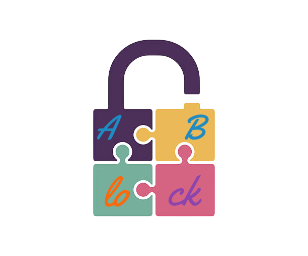

<a id="readme-top"></a>

<br />
<div align="center">
  <a href="https://github.com/Binary1Brains/ABlock">
    
  </a>

<h3 align="center">ABlock – Minimal Wayland Screen Locker</h3>

  <p align="center">
    Lightweight, secure, and visually pleasing screen locker for Wayland compositors that support <code>ext-session-lock-v1</code>.
    <br />
    Built with pure C, Wayland, xkbcommon, and PAM.
    <br />
    <a href="https://github.com/Binary1Brains/ABlock"><strong>Explore the docs »</strong></a>
    <br />
    <br />
    &middot;
    <a href="https://github.com/Binary1Brains/ABlock/issues">Report Bug</a>
    &middot;
    <a href="https://github.com/Binary1Brains/ABlock/issues">Request Feature</a>
  </p>
</div>

<p align="center">
  <a href="https://github.com/Binary1Brains/ABlock/graphs/contributors">
    
  </a>
  <a href="https://github.com/Binary1Brains/ABlock/network/members">
    
  </a>
  <a href="https://github.com/Binary1Brains/ABlock/stargazers">
    
  </a>
  <a href="https://github.com/Binary1Brains/ABlock/issues">
    
  </a>
  <a href="https://github.com/Binary1Brains/ABlock/blob/main/LICENSE">
    
  </a>
</p>

<details>
  <summary>Table of Contents</summary>
  <ol>
    <li>
      <a href="#about-the-project">About The Project</a>
      <ul>
        <li><a href="#built-with">Built With</a></li>
        <li><a href="#key-features">Key Features</a></li>
      </ul>
    </li>
    <li>
      <a href="#security--design">Security & Design</a>
      <ul>
        <li><a href="#brute-force-protection">Brute‑force Protection</a></li>
        <li><a href="#memory-hardening">Memory Hardening</a></li>
        <li><a href="#pam-integration">PAM Integration</a></li>
      </ul>
    </li>
    <li>
      <a href="#getting-started">Getting Started</a>
      <ul>
        <li><a href="#prerequisites">Prerequisites</a></li>
        <li><a href="#installation">Installation</a></li>
      </ul>
    </li>
    <li><a href="#usage">Usage</a></li>
    <li><a href="#compositor-support">Compositor Support</a></li>
    <li><a href="#roadmap">Roadmap</a></li>
    <li><a href="#license">License</a></li>
    <li><a href="#contact">Contact</a></li>
  </ol>
</details>

## About The Project

**ABlock** is a minimal, secure, and beautiful screen locker for Wayland compositors that implement the `ext-session-lock-v1` protocol (e.g., Sway ≥1.7, River, Hyprland, Wayfire, Cosmic). It provides:

- **Animated password entry** with 18 pulsating dots arranged in a ring.
- **Password strength arc** that fills as you type.
- **Error flash** and exponential lockout on repeated failures.
- **Syslog logging** of authentication attempts.
- **Lock icon** and clean aesthetic.

All drawing is done in software (no Cairo/Pango) to keep dependencies minimal and performance predictable.

>Note: This is a project built on my spare time. I might not be able to actively maintain it. Might contain bugs. INSTALL AT YOUR OWN RISK

### Built With

* [![C][C-badge]][C-url]
* [![Wayland][Wayland-badge]][Wayland-url]
* [![xkbcommon][xkbcommon-badge]][xkbcommon-url]
* [![PAM][PAM-badge]][PAM-url]

### Key Features

- **Pure C, no heavy GUI libraries** – Only Wayland, xkbcommon, PAM, and libm.
- **Multi‑monitor support** – Creates a lock surface on every output.
- **Brute‑force protection** – Exponential backoff (1,2,4,8,16,30 s) + syslog warnings.
- **Memory hardening** – Password buffer is locked (`mlock`) and zeroed on exit.
- **Visual feedback** – Dots react to typing, error flash, lockout state.
- **Low resource usage** – ~5 MB RAM, negligible CPU on modest hardware.

<p align="right">(<a href="#readme-top">back to top</a>)</p>

## Security & Design

### Brute‑force Protection

After each failed attempt, the lockout duration doubles up to 30 seconds. Failed attempts are logged via `syslog` with `LOG_AUTH | LOG_WARNING`. The lockout state is visually indicated by orange dots.

### Memory Hardening

The password buffer is locked in RAM with `mlock()` to prevent swapping to disk. It is explicitly overwritten with `explicit_bzero()` before the program exits.

### PAM Integration

ABlock uses the system PAM stack with the `login` service, respecting all PAM modules (e.g., fingerprint, 2FA, password policies). The PAM conversation function is minimal and returns only empty responses for non‑password prompts.

<p align="right">(<a href="#readme-top">back to top</a>)</p>

## Getting Started

### Prerequisites

- A Wayland compositor that supports `ext-session-lock-v1` (see [Compositor Support](#compositor-support))
- Development packages: `wayland-client`, `xkbcommon`, `libpam`, `libm`, `wayland-protocols`

**Dependencies (System Packages)**
On a typical Linux distribution:

1. *Debian/Ubuntu:*
  ```sh
  sudo apt install libwayland-dev libxkbcommon-dev libpam0g-dev libc6-dev wayland-protocols
  ```

2. *Arch Linux:*
  ```sh
  sudo pacman -S wayland wayland-protocols libxkbcommon pam
  ```

3. *Fedora:*
  ```sh
  sudo dnf install wayland-devel libxkbcommon-devel pam-devel wayland-protocols-devel
  ```

### Installation

1. **Clone the repository**

   ```sh
   git clone https://github.com/Binary1Brains/ABlock.git
   cd ABlock
   ```

2. **Build**

   ```sh
   make
   ```
   The Makefile automatically generates the Wayland protocol headers from `ext-session-lock-v1.xml` (provided by `wayland-protocols`).

3. **Install**
   
   ```sh
   sudo make install
   ```
   This installs `ABlock` to `/usr/local/bin`.
<p align="right">(<a href="#readme-top">back to top</a>)</p>

### Usage
Run the locker directly from a terminal or bind it to a keyboard shortcut (e.g., in Sway config):
```bash
ABlock
```
The screen will lock immediately. Type your password – the arc fills and dots brighten. Press `Enter` to submit, `Backspace` to delete, `Escape` to clear the field.

If the password is correct, the session unlocks. After 5 consecutive failures, the lockout period begins (visualised by orange dots). All failed attempts are logged.

>Note: ABlock must be run inside a Wayland session with the required protocol available.

## Compositor Support 

| Compositor | Support for  ext-session-lock-v1 |
-------------|----------------------------------|
| Sway	| ✅ ≥1.7 |
| Hyprland	| ✅ (built‑in) |
| River	| ✅ (via rivertile or standalone) |
| Wayfire |	✅ (with wayfire-plugins-extra) |
| Cosmic	| ✅ (alpha) |
| Mango	| ? (not yet) |
-----------------------
<p align="right">(<a href="#readme-top">back to top</a>)</p>

## Roadmap
- [x] Basic lock surface with keyboard input

- [x] Animated dots and arc progress

- [x] Multi‑monitor support

- [x] PAM authentication

- [x] Brute‑force protection + syslog

- [x] Memory hardening (mlock, explicit_bzero)

- [ ] DPMS / display power saving after idle timeout

- [ ] Configuration file for colors and dot count

- [ ] Optional cairo backend for smoother anti‑aliasing
<p align="right">(<a href="#readme-top">back to top</a>)</p>

## License
Distributed under the MIT License. See [LICENSE](https://github.com/Binary1Brains/ABlock/blob/main/LICENSE) for more information.

## Contact

| Name | LinkedIn |
|------|----------|
| Parijat Dhar | [![LinkedIn][linkedin-badge]][parijat-url] |
-------------------------------------------------------------

Project Link: https://github.com/Binary1Brains/ABlock
<p align="right">(<a href="#readme-top">back to top</a>)</p><!-- Badge definitions -->

[C-badge]: https://img.shields.io/badge/C-00599C?style=flat&logo=c&logoColor=white
[C-url]: https://en.wikipedia.org/wiki/C_(programming_language)
[Wayland-badge]: https://img.shields.io/badge/Wayland-FF8C00?style=flat&logo=wayland&logoColor=white
[Wayland-url]: https://wayland.freedesktop.org/
[xkbcommon-badge]: https://img.shields.io/badge/xkbcommon-4A4A4A?style=flat&logo=linux&logoColor=white
[xkbcommon-url]: https://xkbcommon.org/
[PAM-badge]: https://img.shields.io/badge/PAM-003B6F?style=flat&logo=linux&logoColor=white
[PAM-url]: https://en.wikipedia.org/wiki/Privileged_access_management
[linkedin-badge]: https://img.shields.io/badge/LinkedIn-0077B5?style=flat&logo=linkedin&logoColor=white
[parijat-url]: https://www.linkedin.com/in/parijat-dhar-3b17a329a
